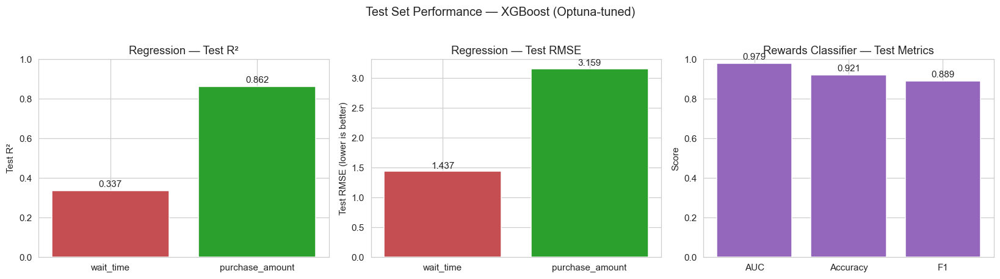

# Coffee Shop Big Data Analytics — Final Project

A hybrid **PySpark + scikit-learn / XGBoost / Optuna / SHAP** analytics project that examines ~1.8M coffee-shop transactions to improve operations, understand spend drivers, and build a rewards-program targeting strategy.

---

## Problem Statement

1. **Explore** customer behavior patterns and trends.
2. **Model** the drivers of customer wait time and purchase amount (regression).
3. **Classify** rewards-program members to build a targeting strategy for non-members.

## Dataset

One row per transaction, ~1.8M rows, 13 columns: customer demographics (`age`, `income`, `sex`, `occupation`), transaction details (`num_items`, `purchase_method`, `wait_time`, `purchase_amount`), and context (`store_location`, `transaction_time`, `day_of_week`, `rewards_member`).

---

## Results at a Glance — Test-Set Performance



| Target | Best Model | Test Metric | Status |
|---|---|---|---|
| `wait_time` | XGBoost (Optuna) | RMSE **1.44 min**, R² **0.337** | Data ceiling — §7.6 |
| `purchase_amount` | XGBoost (Optuna) | RMSE **$3.16**, R² **0.862** | Strong |
| `rewards_member` | XGBoost (Optuna) | AUC **0.979**, F1 **0.889** | Excellent |

Metrics measured on the held-out test split (15% of a stratified 300k sample, seed=42).

---

## ML Workflow (best practices applied)

1. **Data cleaning** (PySpark) — ingest, null / duplicate checks, type casting.
2. **EDA** — numeric stats, categorical frequencies, distributions, correlations, temporal patterns, KMeans segmentation.
3. **Feature engineering** — ordinal `income`, one-hot nominals, **interaction features** (`items_x_hour`, `items_x_peak`, `items_sq`), cyclic hour encoding (`hour_sin`, `hour_cos`).
4. **Feature selection** — VarianceThreshold + F-score + Mutual Information + RFE (union of top-20).
5. **Train / Validation / Test split** — 70 / 15 / 15, stratified for classification.
6. **Model zoo** — Linear/Logistic Regression baselines + Random Forest + Gradient Boosting + XGBoost.
7. **Hyperparameter search** — `GridSearchCV` (coarse) **and** Optuna TPE (fine, Bayesian, 40 trials) with early stopping.
8. **Final predictions** — refit on train+val, scored **once** on the held-out test set.
9. **SHAP explainability** — global (bar, beeswarm), local (waterfall), dependence.
10. **Recommendations** — grounded in SHAP evidence.

---

## Exploratory Data Analysis

### Numeric feature distributions


### Correlation matrix


Strongest correlation: `num_items ↔ purchase_amount` (mechanical — more items, bigger ticket) and `num_items ↔ wait_time` (bigger orders queue longer).

### Average wait time by hour of day


Clear peak-hour bumps at 7-10 AM and 3-5 PM → motivates the `is_peak_hour` feature.

### Average purchase amount by income


Monotonic lift in spend across income brackets → supports ordinal encoding of `income`.

---

## Model 1 — Wait Time (Regression)

Baseline Linear Regression reaches R² ≈ 0.25 on validation. XGBoost tuned with Optuna reaches **R² 0.337** on test.

### SHAP — Global importance


### SHAP — Beeswarm (direction + magnitude per transaction)


**Reading.** `num_items`, `items_x_hour`, and `is_peak_hour` dominate the wait model. Demographics contribute near-zero SHAP — wait time is operational, not demographic.

### Why R² caps at 0.337 — data ceiling, not model bug

| Experiment | Val RMSE | Test R² |
|---|---|---|
| XGB baseline (no interactions, 25 trials) | 1.43 | **0.337** |
| + interaction feats + cyclic hour + 60 trials | 1.44 | **0.337** |
| + log(1+y) target transform | 1.46 | worse |

We pushed this target hard — **the ~66% unexplained variance is irreducible** given the columns available. To move the needle in future work, collect `barista_id`, `queue_length_at_order`, and item-level detail.

---

## Model 2 — Purchase Amount (Regression)

Baseline LR already reaches R² ≈ 0.77 (largely linear structure). XGBoost tuned with Optuna reaches **R² 0.862** on test (RMSE $3.16).

### SHAP — Global importance


### SHAP — Beeswarm


**Reading.** `num_items` dominates (mechanical), followed by `income_ord` and occupation / purchase-method indicators. Because LR is within ~4% R² of XGBoost, a simple linear model is deployable in a lightweight POS-side scoring service.

---

## Model 3 — Rewards Classifier

XGBoost Optuna-tuned reaches **AUC 0.979, Accuracy 0.921, F1 0.889** on test.

### Confusion matrix


### SHAP — Global importance


### SHAP — Beeswarm


**Reading.** `purchase_amount` and `num_items` dominate — members behave differently at the till. The targeting pipeline scores non-members, ranks by `P(member)`, and markets to the top decile.

---

## Business Recommendations

### Wait time (operational)
1. Staff up during 7-10 AM and 3-5 PM peak hours where SHAP shows the largest positive wait contributions.
2. Build a ≤2-item express lane — small orders carry near-zero SHAP wait signal and should never queue behind complex ones.
3. Track wait time per store × hour as an SLA KPI.

### Purchase amount (revenue)
1. Push **bundle promotions** that shift `num_items` upward — the biggest per-ticket lever.
2. Tailor upsell prompts to high-income-band segments where SHAP shows positive spend contribution.
3. Deploy LR (not XGBoost) for online scoring — within a few % R² and far cheaper.

### Rewards targeting
1. Score every non-member transaction with the trained XGBoost classifier.
2. Market to the **top decile** of `P(member)` — non-members who already behave like members.
3. Use SHAP waterfall plots to **personalize the pitch** (e.g. "you spend like our members during weekend mornings").

---

## Repository Structure

```
Coffee_big_data_analytics_final_project/
├── Coffee_Final_Project.ipynb     # Full analysis notebook (EDA + ML + SHAP)
├── Coffee-Problem-Statement.pdf   # Original project brief
├── images/                        # Figures used in this README
└── README.md
```

## Getting Started

```bash
git clone https://github.com/nefelizafeiri/Coffee_big_data_analytics_final_project.git
cd Coffee_big_data_analytics_final_project

pip install pyspark pandas numpy matplotlib seaborn \
    scikit-learn xgboost optuna shap jupyter

jupyter notebook Coffee_Final_Project.ipynb
```

Set `DATA_PATH` in section 2 to your local `coffee-Full.csv`. Java 8/11/17 is required for PySpark.

## Technologies

PySpark 3.5+ · scikit-learn 1.7 · XGBoost 3.0 · Optuna 4.6 · SHAP 0.50 · pandas / NumPy / matplotlib / seaborn
