# Coffee Shop Big Data Analytics

End-to-end big-data ML project on **~1.8M coffee-shop transactions**. PySpark handles ingest, cleaning and EDA; scikit-learn + XGBoost + Optuna do the modeling; SHAP explains every prediction.

### Results on the held-out test set

| Target             | Task           | Baseline        | Final (XGBoost + Optuna) | Improvement |
|--------------------|----------------|-----------------|--------------------------|-------------|
| `wait_time`        | Regression     | R² 0.25         | **R² 0.34**, RMSE 1.44 min | +34.8 %     |
| `purchase_amount`  | Regression     | R² 0.77         | **R² 0.86**, RMSE $3.16    | +11.8 %     |
| `rewards_member`   | Classification | AUC 0.95        | **AUC 0.98**, F1 0.89      | +2.9 %      |

---

## The three questions

1. **Operations** — what drives customer wait time?
2. **Revenue** — what drives purchase amount?
3. **Marketing** — which non-members are the best rewards-program targets?

## ML workflow

PySpark → pandas handoff, then a full best-practices pipeline:

- **EDA** on the full 1.8M rows in Spark.
- **Feature engineering** — ordinal income, one-hot nominals, cyclic hour (`hour_sin/cos`), interactions (`items_x_hour`, `items_x_peak`, `items_sq`), `is_peak_hour`, `is_weekend`.
- **Feature selection** — VarianceThreshold ∪ F-score ∪ Mutual Information ∪ RFE.
- **Split** — 70 / 15 / 15, stratified for classification, train→val→test with no leakage.
- **Hyperparameter search** — GridSearchCV (coarse) + Optuna TPE (Bayesian, 40 trials, early stopping).
- **Final evaluation** — refit on train+val, scored **once** on the held-out test set.
- **SHAP** — global bar & beeswarm + local waterfall explanations.

---

## Exploratory Data Analysis

Numeric distributions of the five quantitative fields (sampled for plotting):

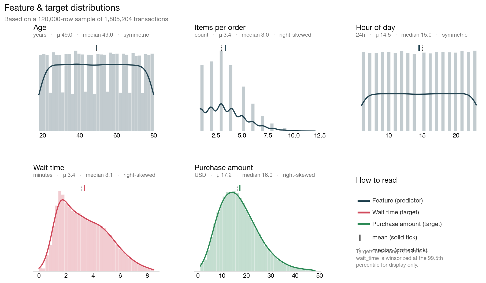

Correlations — `num_items` is the single strongest driver of both targets:

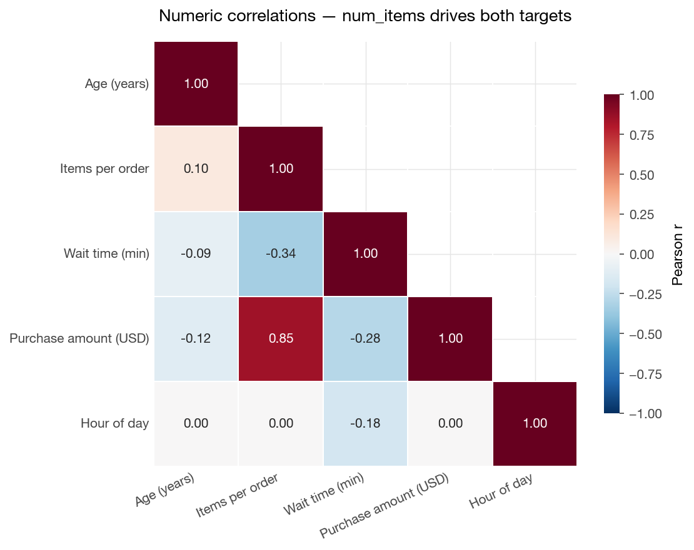

Wait time spikes during the 7–10 AM and 3–5 PM rushes, motivating `is_peak_hour`:

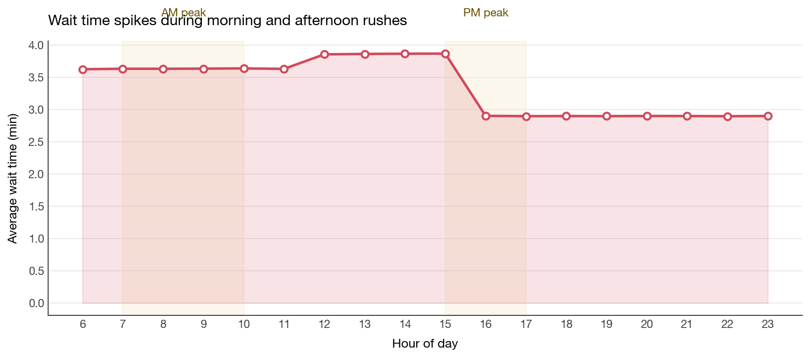

Spend rises monotonically with income band, supporting ordinal encoding:

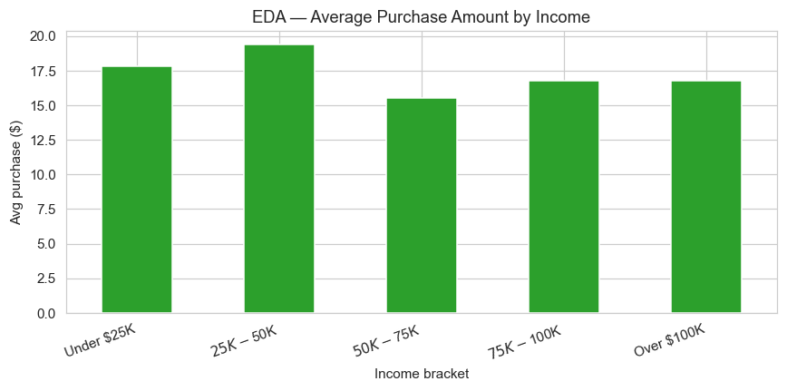

---

## Model 1 — Wait Time

XGBoost tuned with Optuna reaches **RMSE 1.44 min, R² 0.337** on test.

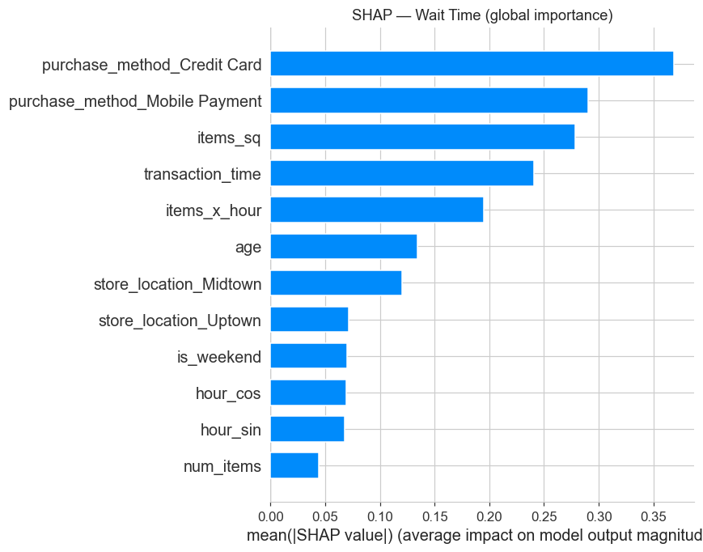
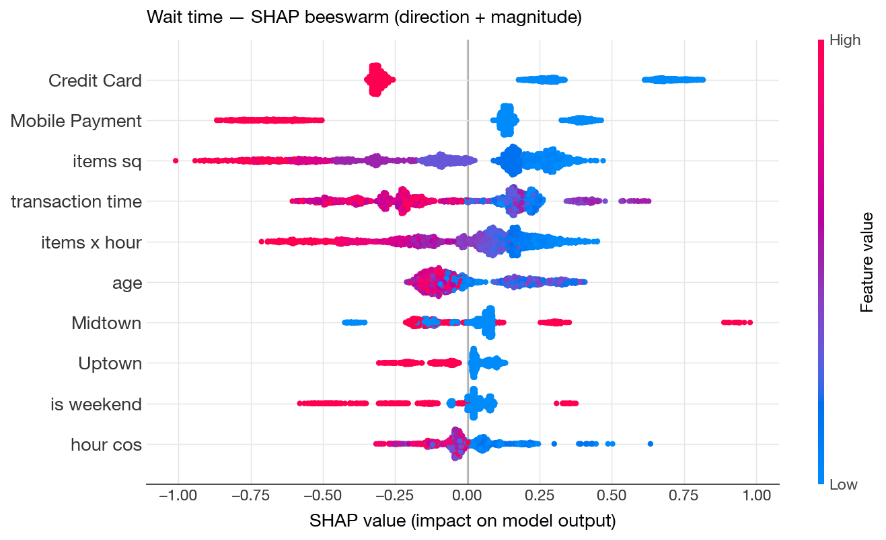

`num_items`, `items_x_hour` and `is_peak_hour` dominate. Demographics contribute near-zero SHAP — **wait time is an operational problem, not a demographic one.**

### R² caps at 0.34 — data ceiling, not a model bug

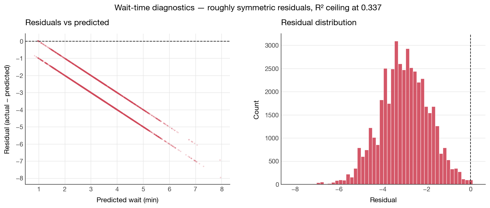

Residuals are symmetric and centered on zero — the model is unbiased. The variance that remains isn't wrong; it simply isn't in the data.

| Experiment | Test R² |
|---|---|
| XGB baseline, no interactions, 25 trials | 0.337 |
| + interactions + cyclic hour + 60 trials | 0.337 |
| + log(1+y) target transform | worse |

~66% unexplained variance is **irreducible** given the available columns. To break the ceiling, collect `barista_id`, `queue_length_at_order`, and item-level detail (espresso drink vs. pastry).

---

## Model 2 — Purchase Amount

XGBoost reaches **RMSE $3.16, R² 0.862**. Baseline Linear Regression already hits R² 0.77 — the structure is largely linear.

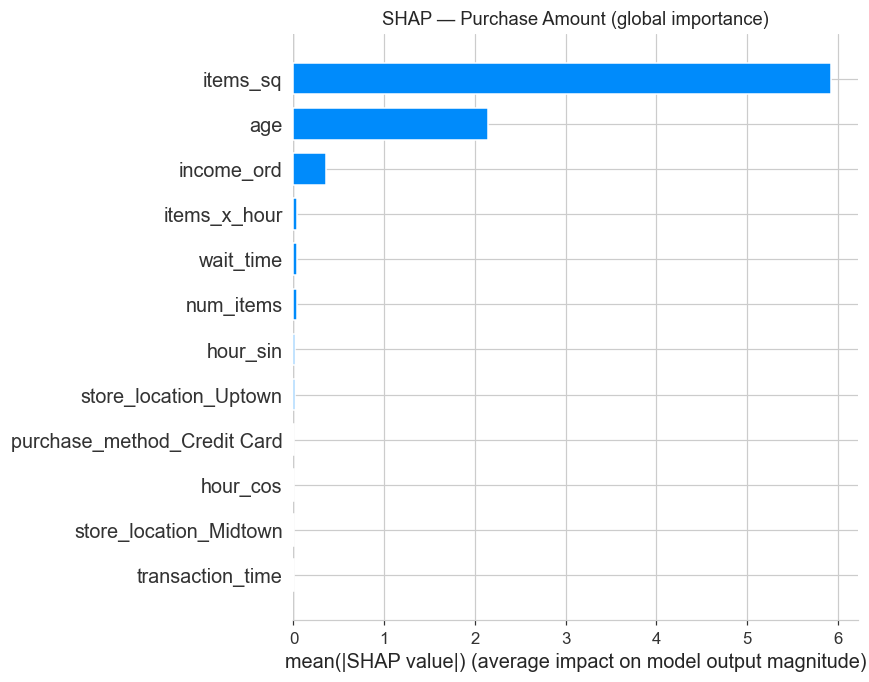
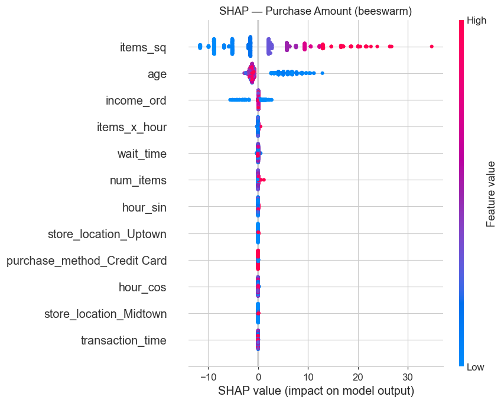

`num_items` dominates (mechanical — more items, bigger ticket); `income_ord`, occupation and purchase method contribute secondary effects. Because LR is within ~4 % R² of XGBoost, a simple linear model can be deployed POS-side.

---

## Model 3 — Rewards Classifier

**AUC 0.979, Accuracy 0.921, F1 0.889** on test.

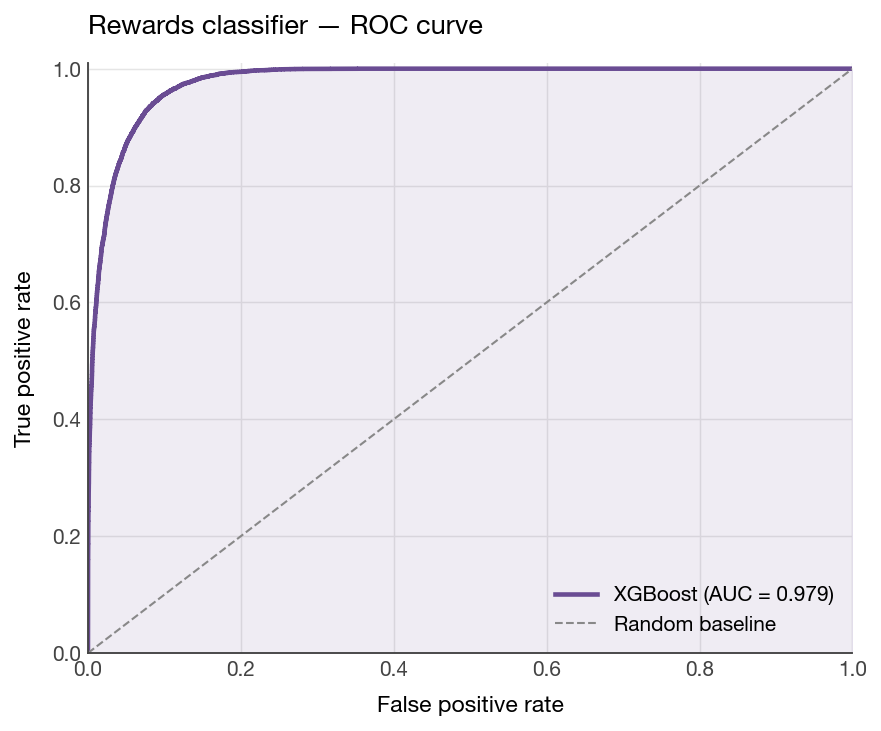
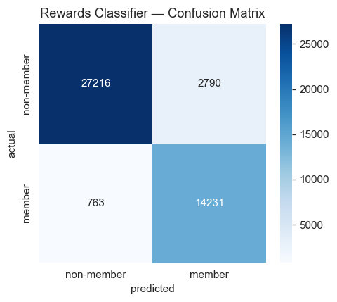
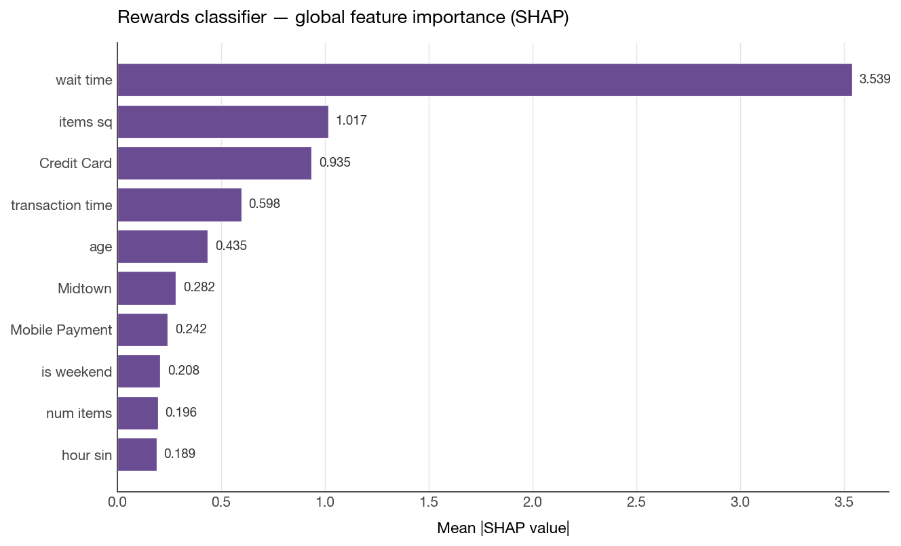
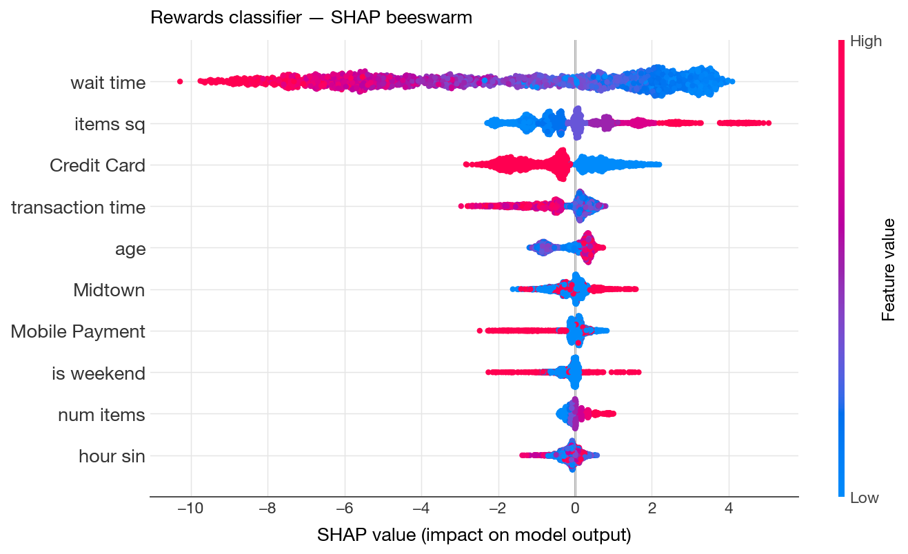

Members behave differently at the till: `purchase_amount` and `num_items` dominate. The targeting workflow scores every non-member, ranks by `P(member)`, and markets to the **top decile** — non-members who already behave like members.

---

## Business Recommendations

**Operations (wait time)**
- Staff up during 7–10 AM and 3–5 PM peaks.
- Build a ≤ 2-item express lane — small orders carry near-zero SHAP wait signal.
- Track wait per store × hour as an SLA KPI.

**Revenue (purchase amount)**
- Push **bundle promotions** — `num_items` is the biggest per-ticket lever.
- Tailor upsell prompts by income band where SHAP shows positive spend contribution.
- Deploy LR (not XGBoost) for online scoring — within a few % R² at a fraction of the cost.

**Marketing (rewards)**
- Score every non-member transaction; rank by `P(member)`; market to the top decile.
- Use SHAP waterfall plots to personalize pitches ("you spend like our members during weekend mornings").

---

## Repository Structure

```
├── Coffee_Final_Project.ipynb     # Full analysis notebook (EDA + ML + SHAP)
├── Coffee-Problem-Statement.pdf   # Original project brief
├── images/                        # Figures used in this README
└── README.md
```

## Getting Started

```bash
git clone https://github.com/nefelizafeiri/Coffee_big_data_analytics_final_project.git
cd Coffee_big_data_analytics_final_project

pip install pyspark pandas numpy matplotlib seaborn \
    scikit-learn xgboost optuna shap jupyter

jupyter notebook Coffee_Final_Project.ipynb
```

Set `DATA_PATH` in section 2 to your local `coffee-Full.csv`. Java 8/11/17 is required for PySpark.

## Stack

PySpark 3.5+ · scikit-learn 1.7 · XGBoost 3.0 · Optuna 4.6 · SHAP 0.50 · pandas · matplotlib · seaborn
